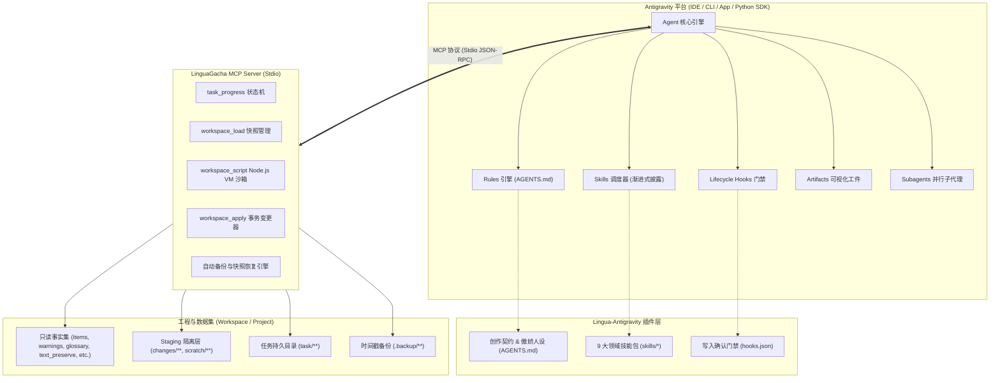
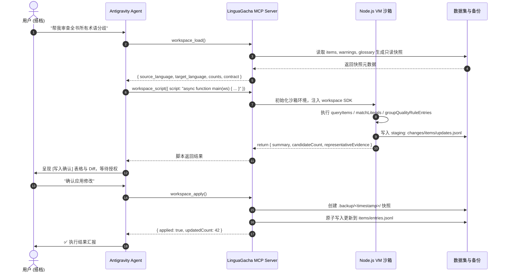

# 系统架构与映射设计 (Architecture)

本文档阐述将 **LinguaGacha Agent 模式** 移植至 **Google Antigravity (AGY)** 平台的完整技术架构、状态所有权以及模块映射机制。

---

## 1. 架构演进与对比 (Evolution & Mapping)

### 原始 LinguaGacha 架构
在原版 LinguaGacha 中，Agent 基于 `@earendil-works/pi-coding-agent` 构建：
- 运行在 Electron Main 进程的 Node.js 内存环境中。
- 通过单会话持有模型历史、上下文压缩、输入队列与工具事件分发。
- 工作区脚本通过 Electron 内部的隐藏 Chromium 一次性 Renderer 注入执行。
- UI 事件通过本地 SSE 向 React 前端广播。

### 目标 Antigravity 增强架构
在 Antigravity 体系中，我们将上述紧密耦合的系统解耦为标准的 **“规则 + 技能 + 协议工具 + 容灾沙箱”** 现代化开放架构：



---

## 2. 核心模块与映射矩阵

| 模块类别 | LinguaGacha 原实现 | Antigravity 移植实现 | 设计考量与收益 |
| :--- | :--- | :--- | :--- |
| **创作与执行契约** | `resource/agent/system_prompt.md` 顶层契约 | `rules/AGENTS.md` & `rules/GEMINI.md` | Antigravity 自动将 `AGENTS.md` 作为始终激活的根级规则，保证模型任何时候都不发生“防御性拒答/删减”。 |
| **人格与交互协议** | System Prompt 的傲娇人设与 5 大任务阶段 | `rules/AGENTS.md` + 标准 Markdown 表格 | 规范化 Emoji 路标、候选选择表、字段填写表，与 Antigravity 的 Markdown / Mermaid 完美渲染融合。 |
| **领域专业技能** | `resource/agent/skill/*` (JSON + MD) | `skills/*/SKILL.md` (YAML Frontmatter) | 符合 Antigravity 标准的渐进式披露规范，按需加载具体技能和包内 reference，节省上下文 Token。 |
| **动态任务进度** | `AgentTaskProgress` 工具 | MCP Tool: `task_progress` | 提供状态机能力（`start`, `advance`, `read`, `finish`, `cancel`），支持长任务跨回合进度追踪。 |
| **工作区沙箱** | Electron Chromium 一次性 Renderer | Node.js `vm` 沙箱（MCP Server 内部） | 摆脱对 Electron 宿主的依赖，在任何纯 Node.js / CLI 环境下均能以微秒级启动并安全运行 `async function main(workspace)`。 |
| **数据事务与应用** | 内存快照 + SQLite/文件事务写入 | 内存 JSONL 解析 + Staging Overlay + `.backup/` 自动回滚 | 确保只有在获得搭档明确授权后，调用 `workspace_apply` 才会将 `changes/` 覆盖层原子写回原文件。 |
| **并行审校增强** | 单会话单线程循环 | Antigravity Subagents (`invoke_subagent`) | 架构升级：主 Agent 负责分发批次，多个子 Agent 并行审校各个分卷或词条，最后汇总收敛。 |

---

## 3. 工作区沙箱执行模型 (Workspace Sandbox)

在执行复杂翻译审校或质量规则挖掘时，模型不需要一次性读取数万条文本，而是通过编写一段标准的 JavaScript 入口脚本完成程序化处理：



---

## 4. 状态机与生命周期设计

### ① Task Progress 状态机
```text
               ┌─────────┐
               │  IDLE   │
               └────┬────┘
                    │ start(tasks)
                    ▼
               ┌─────────┐
      ┌───────►│ RUNNING │◄────────┐
      │        └────┬────┘         │
      │ advance()   │ advance()    │ read()
      │ (next step) │ (add steps)  │
      └─────────────┴──────────────┘
                    │
         ┌──────────┴──────────┐
         │ finish()            │ cancel()
         ▼                     ▼
   ┌───────────┐         ┌───────────┐
   │ COMPLETED │         │ CANCELLED │
   └───────────┘         └───────────┘
```

- **`start`**: 登记初始已知工作项（如 `discover:seed`, `discover:residual`, `finalize:changes`）。
- **`advance`**: 原子完成当前项，并可同时追加新派生的代际工作项（如 `discover:g1`, `review:batch:1`）。
- **`read`**: 查询当前未完成标签、已完成历史与进度统计。
- **`finish`**: 当且仅当所有必要工作已完成且待办为空时收敛。
- **`cancel`**: 显式废弃当前任务并清理状态。

### ② Roleplay 分支状态追踪
Roleplay 技能通过 `task/roleplay/state.json` 保持分支世界的唯一状态事实：
- `player`: 玩家身份、外显锚点（`anchors.presence`）、截至分支点的能力与知识。
- `narration`: 语言、人称、视角、回合长度目标与表达偏好。
- `scene`: 当前时间、地点、在场人物位置/姿态/正在进行的动作与环境压力。
- `actors`: 非玩家角色锚点（`presence`, `voice`, `behavior`）与即时认知/目标状态（`current`）。
- `relations`: 具有方向性的人物关系、立场与承诺。
- `world_threads`: 后台事件推动器与消息传播。
- `branch_facts`: 分支产生的因果事实与长期后果。

---

## 5. 安全与权限架构

1. **只读数据隔离**：`datasets/`、`project_meta.json`、`contract.json` 在沙箱中只读，禁止任何直接写入或删除。
2. **唯一写通道**：所有写入只能通过 `changes/**` 声明的固定文件格式，或管理 `task/**` 与 `scratch/**`。
3. **两阶段显式授权**：
   - 第一阶段：模型只能通过 `workspace_load` 和 `workspace_script` 分析数据、生成候选并向搭档呈现。
   - 第二阶段：必须在搭档给出明确的授权指令后，方可调用 `workspace_apply` 真正提交修改。
