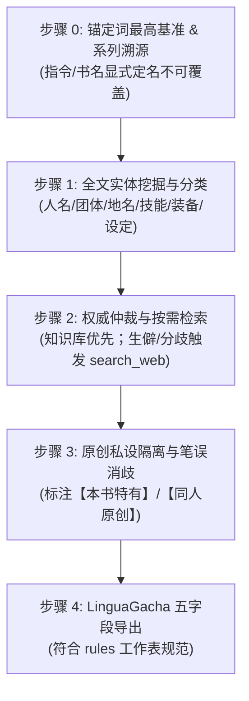

# 泛二次元作品术语外部核验与校准 (@skill(acg-glossary-verification))

本技能为泛二次元作品（日式校园偶像、奇幻轻小说、机战、科幻、都市恋爱及同人二次创作）提供外部权威核验、标准定译仲裁与 LinguaGacha 五字段导出的主控工作流。

---

## 1. 适用场景与触发判定

当涉及以下情况时，激活本技能规程：
1. **多 IP 跨界 / 同人作**：多设定融合，需按对应原作粉丝标准与百科独立仲裁；
2. **历史译名冲突**：民间早期音译、直译与官方新译存在分歧；
3. **生僻专有名词**：复杂的片假名西文/德文借词、魔法/技能、战术机型等；
4. **原创/私设甄别**：区分全网既有标准定译与原作者独创设定；
5. **系列续作/外传**：书名包含 `その後の`、`続`、`外伝`、`新章` 时考证世代关系。

---

## 2. 核心审查与消歧四步流

### 步骤 0：用户锚定词优先与系列溯源
- **搭档显式定名最高优先级**：指令或文件名中已有的译名即为法定基准，所有复合词以此为根完全统一。
- **系列续作前置考证**：含续作/外传标识时轻量检索前作主角与大事件，杜绝遗漏元老角色。

### 步骤 1：实体挖掘与领域分类
- 借助 `@skill(quality-rule-create)` 工具链抽取片假名复合词、带中点姓名及世界观专有名词。
- 详细避坑要点与典型错误对照参见 **[避坑指南与核查清单](./references/bad_cases.md)**。

### 步骤 2：外部检索与权威定译仲裁
- **知识库优先**：主流知名角色招式大模型内化直接判定，免盲目逐条联网。
- **按需精准检索**：遇生僻外来语或严重分歧时，按优先级矩阵检索（萌娘百科/官中 Tier 1）。
- 详见权威层级与语法：**[权威数据源优先级矩阵与检索策略](./references/source_matrix.md)**。

### 步骤 3：原创私设隔离与笔误消歧
- 外部百科无收录且确认为作者自创实体：遵循构词规律翻译，并在 `info` 明确标注 `【本书特有】` 或 `【同人原创设定】`。
- 原文笔误建立消歧映射，在 `info` 标注 `【原文笔误消歧】`。

### 步骤 4：LinguaGacha 五字段标准化导出
- 严格遵循 `@skill(glossary-rules)` 规定的五字段契约（`src`, `dst`, `info`, `regex: false`, `case_sensitive: false`）。
- 参考输出范例：**[标准五字段 JSON 样本](./examples/glossary_sample.json)**。
- XLSX 规范：工作表名称固定为 `"rules"`，首行为 5 列标准表头。
