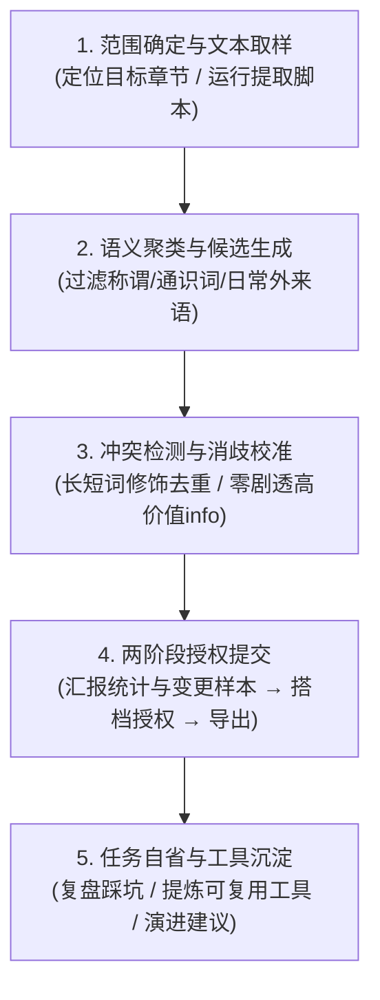

# 质量规则统一工作流引擎

本工作流为质量规则（术语表 `glossary` 与文本保护 `text_preserve`）提供端到端的创建与审查标准化流程。
- 涉及术语判定标准时读取 `@skill(glossary-rules)`；
- 涉及泛二次元专名外部核验时调用 `@skill(acg-glossary-verification)`；
- 涉及格式保护时读取 `@skill(text-preserve-rules)`。

---

## 一、 工作模式

本工作流支持两种操作模式：

1. **`mode: create`（规则创建）**：
   - 从原著文本或 EPUB 中挖掘新专有名词、角色、组织、技能及格式标记。
   - 建立符合 LinguaGacha 标准五字段契约的全新规则集。
2. **`mode: review`（规则审查，整合原审查模块）**：
   - 对工程中已存在的术语表或规则文件进行全面体检。
   - 识别同义词分歧、包含冲突、被弃用的旧译名、大小写冲突及未在正文中出现的幽灵词条。
   - 形成保留、更新、合并或删除建议。

---

## 二、 原生四步执行流

### 步骤 1：范围确定与文本取样
- 确定本次操作的目标文件与范围（整本小说、指定章节或已有术语表）。
- 如为长篇文本或 EPUB，推荐优先使用 `@skill(quality-rule-create)` 内置的 `epub_glossary_toolkit.py` 自动化提取纯文本与语境切片；如为特定段落，可通过 `view_file` 或 `grep_search` 直接检视。

### 步骤 2：语义聚类与候选生成
充分发挥大模型内化的语义理解与模式识别优势，并执行前置边界过滤：
- **专有名词挖掘**：识别片假名复合词、带中点姓名、特殊引号（如『...』）及世界观专有名词。
- **前置噪音阻断（硬红线）**：
  - 自动剔除 `人名 + (君|先生|先輩|さん|ちゃん|様等)` 派生敬称称谓；
  - 剔除下游大模型能稳定翻译的通识社团（`新聞部`、`生徒会` 等）、自解释复合词（`不思議調査隊` 等）及日常外来语（`クラス`、`ピアノ` 等）。
- **结构形态聚类**：将具有关联性、同系列、同派系或同词根的条目聚合为同一逻辑组共同审视，杜绝孤立割裂判定。

### 步骤 3：冲突检测与消歧校准
依据领域判据逐条确立条目有效性：
- **100% 真实命中硬约束**：严禁脑补原文未出现的幽灵词条，必须核验在正文中的连续字面量出现证据。
- **嵌套实体与修饰扩展去重**：当核心专名实体（如 `大園高校`、`濃硫酸女`）已收录时，带有普通限定修饰/从属前缀的长词（如 `私立大園高校`、`理科室の濃硫酸女`）一律抑制剔除，杜绝长短词冗余。
- **全称与简称联动机制**：
  - 全称承载完整设定与核心身份定位；
  - 常用简称承载明确指向与消歧提示（例：“男性，主角诺艾尔的常用简称”），避免机翻语义漂移。
- **`info` 字段高价值精简（零剧透）**：
  - 角色限标注「性别+核心身份」，技能限标注「动作类型/属性」指导动词，地名设施标注「类别」；
  - 严格限制在 10~20 字以内，坚决杜绝生平履历、遇害解谜等小说剧情剧透。

### 步骤 4：两阶段授权提交（安全红线）
1. **方案汇报（写入确认阶段）**：
   向搭档汇报条目总数、分类统计（角色/地名/技能等）以及具有代表性的重点词条示例与修改 Diff。
2. **获得显式授权后导出**：
   搭档确认后，调用原生写入工具或运行工具链导出为标准 LinguaGacha 兼容格式（UTF-8 编码、4 空格缩进的 JSON，或包含 `rules` 工作表的 XLSX 文件）。

### 步骤 5：任务自省与工具沉淀 (Task Retrospective)
在任务交付或结束后，必须向搭档进行简明复盘总结：
1. **`🚧 踩坑与化解`**：复盘本次任务中遇到的边界陷阱（如嵌套长词冲突、称谓污染等）及解决方案；
2. **`🛠️ 效率工具与沉淀`**：提炼本次新增或优化的小工具/脚本函数/正则模式，沉淀为可复用资产；
3. **`📈 工作流演进建议`**：总结本次任务中发现的工作流或规则盲点，提出下一步演进优化方向。
